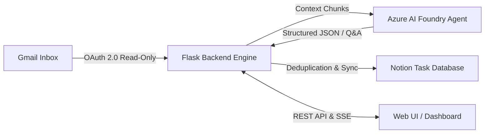

# 🎓 Knowledge Mining Agent (Student AI)

<p align="center">
  
  
  
  
  
  
  
</p>

---

## 📌 Overview

**Knowledge Mining Agent** is an intelligent, privacy-first local student assistant that connects academic communication channels directly to productivity workflows:

$$\text{Gmail Inboxes} \xrightarrow{\quad\text{Google OAuth 2.0}\quad} \text{Flask Engine} \xrightarrow{\quad\text{Azure AI Foundry}\quad} \text{Structured Extraction} \xrightarrow{\quad\text{Notion API}\quad} \text{Task Database}$$

Instead of manually sifting through hundreds of college announcement emails, newsletters, and submission threads, the Knowledge Mining Agent automatically:
1. **Mines knowledge** from your academic Gmail inbox.
2. **Understands contextual timelines** using Azure AI Foundry agents.
3. **Extracts actionable tasks, exams, labs, and deadlines** into structured JSON.
4. **Syncs seamlessly into your personal Notion database** with built-in duplicate prevention.
5. **Provides an interactive AI chat interface** to answer natural language questions about your courses, schedules, and assignments.

---

## 🏗️ Architecture & Data Flow



---

## ✨ Features

- 💬 **Conversational AI over College Email**: Ask questions like *"When is my next Machine Learning assignment due?"* or *"What did the professor say about the midterm exam?"* and get instant answers grounded strictly in retrieved emails.
- 🔍 **Context-Aware Query Routing**: Translates natural temporal questions (*"today"*, *"this week"*, *"exams"*, *"projects"*) into optimized Gmail search queries.
- 📋 **Automated Task & Deadline Mining**: Scans inbox messages, strips irrelevant noise (OTPs, promotional spam, alerts), and identifies true actionable requirements.
- 🛡️ **Intelligent Deduplication**: Uses Gmail unique message IDs (`Source Email`) to ensure tasks are never duplicated in Notion across multiple scan cycles.
- 📅 **Schedule & Calendar Visualizer**: Aggregates upcoming academic deadlines and priority levels in a clear, interactive visual dashboard.
- 🔒 **Privacy-First & Local-Only**: Your emails, Google OAuth tokens, and API requests stay strictly on your local machine and your private cloud instances.

---

## 🛠️ Tech Stack

- **Backend**: Python 3.10+, Flask, Flask-CORS, BeautifulSoup4, Requests
- **Cloud & AI**: Microsoft Azure AI Foundry (`azure-ai-projects`, `azure-identity`, OpenAI SDK)
- **Integrations**: Google APIs (`google-api-python-client`, `google-auth-oauthlib`), Notion REST API
- **Frontend**: HTML5, Vanilla JavaScript, CSS3 Design System

---

## 📋 Prerequisites & Cloud Configuration

Before running the application, make sure you have:
- **Python 3.10+** installed.
- A **Google Cloud Project** with the Gmail API enabled.
- A **Microsoft Azure AI Foundry** resource with a deployed Agent.
- A **Notion Developer Account** with an Internal Integration and a database.

---

### 1. Google Cloud Setup (Gmail API)

1. Navigate to the [Google Cloud Console](https://console.cloud.google.com/).
2. Create a new project (e.g. `Student-AI-Agent`).
3. Enable the **Gmail API** under **APIs & Services > Library**.
4. Go to **APIs & Services > OAuth consent screen**:
   - Choose **External** (or Internal for Google Workspace).
   - Add scope: `https://www.googleapis.com/auth/gmail.readonly`.
   - Add your Gmail address as a **Test User**.
5. Go to **APIs & Services > Credentials**:
   - Click **Create Credentials > OAuth client ID**.
   - Application type: **Desktop app**.
   - Download the generated JSON file, rename it to `credentials.json`, and place it in the root directory of this project.

> [!WARNING]
> Never commit `credentials.json` or `token.json` to GitHub. They are already listed in `.gitignore`.

---

### 2. Microsoft Azure AI Foundry Setup

1. Open the [Azure AI Foundry Portal](https://ai.azure.com/).
2. Create or select an AI Project.
3. Deploy a model (e.g., `gpt-4o`, `gpt-4o-mini`, or `gpt-35-turbo`).
4. Create an Agent (e.g. `student-ai-agent`).
5. Copy your **Project Endpoint** URL and **Agent Name** into `.env`.

---

### 3. Notion Integration Setup

1. Go to [Notion Developers - My Integrations](https://www.notion.so/profile/integrations).
2. Create a new **Internal Integration** and copy the **Internal Integration Secret** (`secret_...`).
3. Create a **Tasks Database** in Notion with the following properties:

| Property Name | Notion Property Type | Description |
| :--- | :--- | :--- |
| `Task name` | **Title** | The title / summary of the academic task |
| `course` | **Rich Text** | Course code or subject name |
| `category` | **Rich Text** | Category (Assignment, Exam, Project, Lab) |
| `priority` | **Select** | Priority level (`Low`, `Medium`, `High`) |
| `Status` | **Status** | Task status (`Not started`, `In progress`, `Done`) |
| `Due date` | **Date** | Extracted submission or exam deadline |
| `Source Email` | **Rich Text** | Unique Gmail message ID for deduplication |

4. Click the `...` menu on the top-right of your Notion database page $\rightarrow$ **Connections** $\rightarrow$ Connect your integration.
5. Copy the 32-character database ID from the URL (e.g. `https://notion.so/workspace/<DATABASE_ID>?v=...`) into `NOTION_DATA_SOURCE_ID` in `.env`.

---

## 🚀 Quickstart & Installation

### 1. Clone the Repository

```bash
git clone https://github.com/Anshuman-3902/Knowledge-Mining-Agent.git
cd Knowledge-Mining-Agent
```

### 2. Set Up Virtual Environment

#### On Windows (PowerShell):
```powershell
python -m venv .venv
.venv\Scripts\Activate.ps1
```

#### On macOS / Linux:
```bash
python3 -m venv .venv
source .venv/bin/activate
```

### 3. Install Dependencies

```bash
pip install --upgrade pip
pip install -r requirements.txt
```

### 4. Configure Environment Variables

Copy the template configuration and fill in your keys:

```powershell
cp .env.example .env
```

Edit `.env`:
```env
FOUNDRY_PROJECT_ENDPOINT=https://your-resource.services.ai.azure.com/api/projects/student-ai-agent
FOUNDRY_AGENT_NAME=student-ai-agent
NOTION_TOKEN=secret_your_notion_token
NOTION_DATA_SOURCE_ID=your_notion_database_id
```

### 5. Launch the Application

```bash
python app.py
```

Open your browser and navigate to:
```
http://127.0.0.1:5000
```
*On first launch, a browser window will prompt you to authorize read-only access to your Gmail account. A local `token.json` will be saved securely for future sessions.*

---

## 📡 API Reference

| Endpoint | Method | Description |
| :--- | :--- | :--- |
| `/` | `GET` | Main Web Dashboard Interface |
| `/api/health` | `GET` | Healthcheck verifying Gmail, Azure Foundry, and Notion connectivity |
| `/api/chat` | `POST` | Ask a question about emails (`{"question": "..."}`) |
| `/api/emails` | `GET` | Fetch recent raw emails (last 7 days) |
| `/api/tasks` | `GET` | Retrieve synced academic tasks from Notion |
| `/api/stats` | `GET` | Summary statistics (today's emails, high-priority tasks, assignments) |
| `/api/schedule` | `GET` | Extract scheduled events with deadlines for calendar view |
| `/api/scan` | `POST` | Trigger deep inbox scan (last 30 days) and sync tasks to Notion |

---

## 📁 Project Structure

```
Knowledge-Mining-Agent/
├── .github/
│   ├── ISSUE_TEMPLATE/
│   │   ├── bug_report.yml       # Structured bug report form
│   │   ├── feature_request.yml  # Structured feature proposal form
│   │   └── config.yml           # Issue template config
│   ├── workflows/
│   │   └── ci.yml               # GitHub Actions CI workflow
│   └── PULL_REQUEST_TEMPLATE.md # Pull request checklist
├── docs/
│   └── github_issues.md         # Pre-defined GitHub issue roadmap
├── scripts/
│   └── create_issues.py         # Automation script to populate GitHub issues
├── static/
│   ├── app.js                   # Client-side UI logic & API handler
│   └── style.css                # Interface styles & themes
├── templates/
│   └── index.html               # Web application dashboard template
├── .env.example                 # Environment variables configuration template
├── .gitignore                   # Comprehensive ignore rules
├── app.py                       # Main Flask backend & agent orchestration
├── CODE_OF_CONDUCT.md           # Community guidelines
├── CONTRIBUTING.md              # Contribution guide
├── LICENSE                      # MIT License
├── README.md                    # Project documentation
├── requirements.txt             # Python dependencies
└── SECURITY.md                  # Security and vulnerability policies
```

---

## 🗺️ Roadmap & Issues

We maintain an active backlog of features and enhancements. Check out [docs/github_issues.md](docs/github_issues.md) for full issue specifications:

- [x] Local Gmail OAuth 2.0 Integration & Read-Only Scopes
- [x] Azure AI Foundry Agent Orchestration
- [x] Notion Task Sync with Duplicate Prevention
- [ ] **Background Scheduled Email Poller** (Issue #1)
- [ ] **Semantic Vector Search & Hybrid RAG** (Issue #2)
- [ ] **Custom Notion Database Property Mappings** (Issue #3)
- [ ] **Docker Containerization** (Issue #4)
- [ ] **Automated Test Suite (Pytest + Mock APIs)** (Issue #5)
- [ ] **Microsoft Outlook / Graph API Integration** (Issue #6)
- [ ] **Dark / Light Mode Toggle & Mobile UI** (Issue #7)
- [ ] **Encrypted Token Storage at Rest** (Issue #8)

---

## 🤝 Contributing

Contributions are welcome! Please check out [CONTRIBUTING.md](CONTRIBUTING.md) to get started.

1. Fork the repo.
2. Create your feature branch (`git checkout -b feature/AmazingFeature`).
3. Commit your changes (`git commit -m 'feat: Add AmazingFeature'`).
4. Push to the branch (`git push origin feature/AmazingFeature`).
5. Open a Pull Request.

---

## 📄 License

Distributed under the **MIT License**. See [`LICENSE`](LICENSE) for more details.

---

## 👤 Author

**Anshuman**  
- GitHub: [@Anshuman-3902](https://github.com/Anshuman-3902)
- Repository: [Knowledge-Mining-Agent](https://github.com/Anshuman-3902/Knowledge-Mining-Agent)
